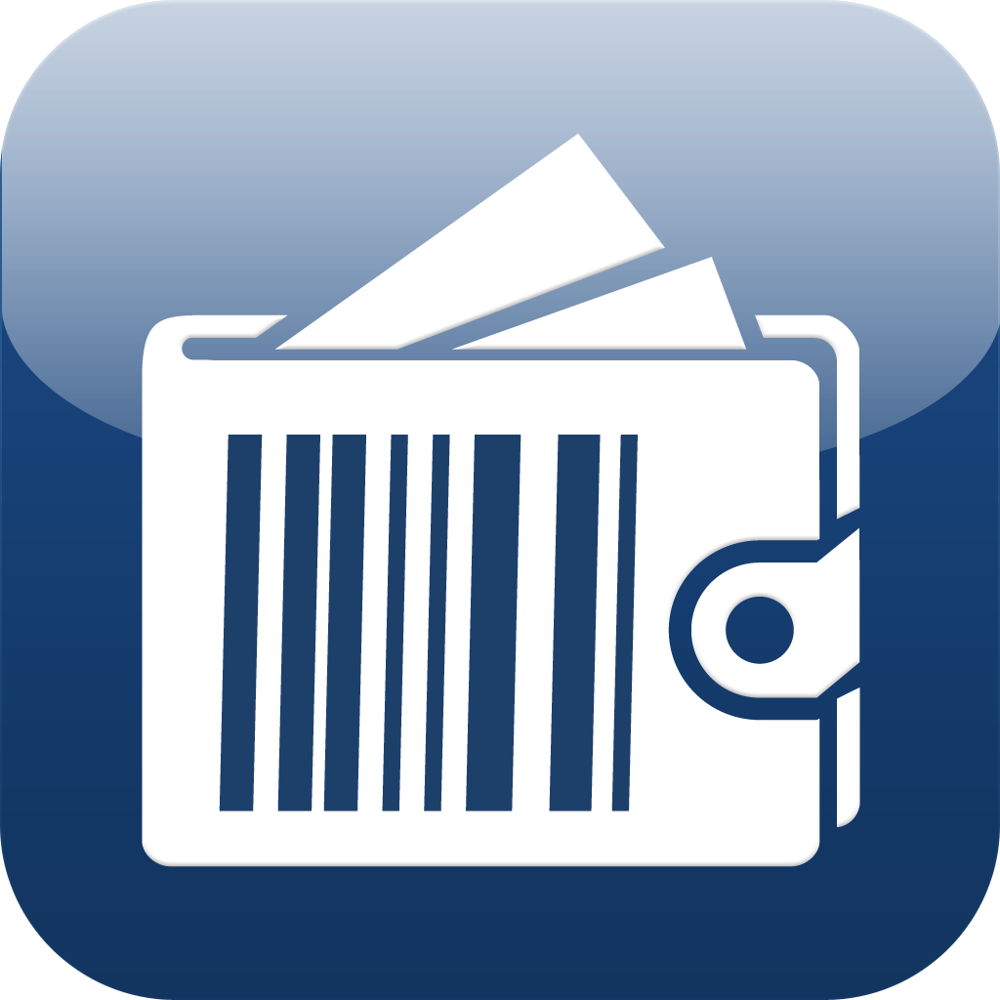

<!-- PROJECT LOGO -->
<br />
<div align="center">
  <a href="https://github.com/othneildrew/Best-README-Template">
    
  </a>

<h3 align="center">Expense Tracker</h3>

  <p align="center">
    An app to manage and track all of your expenses!
    <br />
    </p>
</div>

<!-- ABOUT THE PROJECT -->

## About The Project

This help user create and manage their incomes and expenses. Users can also manage the income sources and expense
categories. Users can also download summary pdf.

Core Modules and Features:

* Auth Module:
    * Login, Sign up, Forgot Password, Email Verification.
* Source Module:
    * Create, Update, Get and Delete Income Sources
* Categories Module:
    * Create, Update, Get and Delete Expense Categories
* Income Module:
    * Create, Update, Get and Delete Incomes
* Expense Module:
    * Create, Update, Get and Delete Expenses
* Report Module:
    * Get summary data, Generate summary in PDF format

### Built With

This project is built using following framework and libraries.

* NestJS - Framework
* Passport - Authentication
* Mongoose - ODM
* Moment - Dates
* Swagger - API Documentation
* PDF Make - PDF Files

<!-- GETTING STARTED -->

## Getting Started

This is an example of how you may give instructions on setting up your project locally.
To get a local copy up and running follow these simple example steps.

### Prerequisites

This is an example of how to list things you need to use the software and how to install them.

* yarn
  ```sh
  npm install yarn -g
  ```

### Installation

_Use the guide below to get started._

1. Clone the repo
   ```sh
   git clone https://github.com/dany131/expense-tracker.git
   ```
2. Install NPM packages
   ```sh
   yarn install
   ```
3. Use `.env.example` as env template and create either `.env.development` or `.env.production` depending on
   environment

4. Running app based on the environment:

```bash
# development
$ yarn run start:dev

# production mode
$ yarn run start:prod
```
